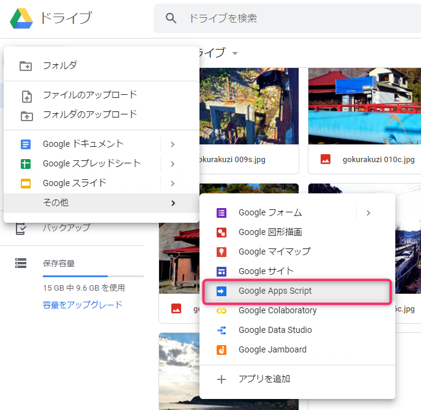
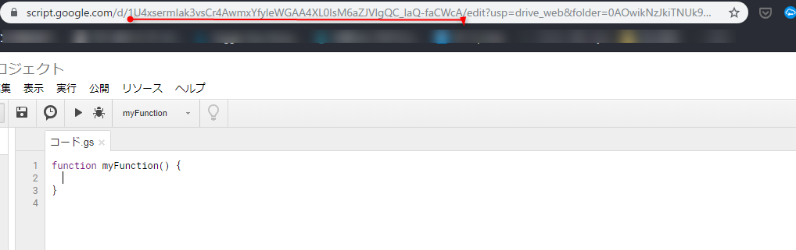
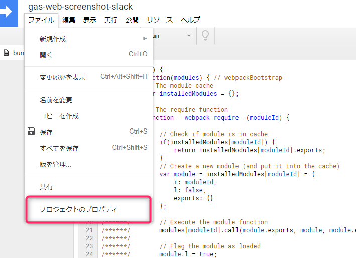
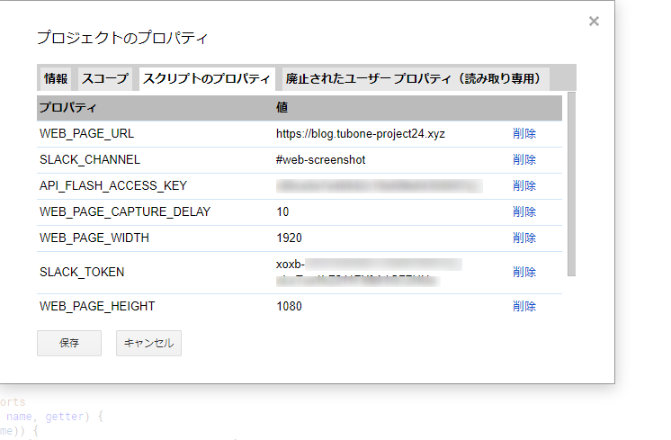
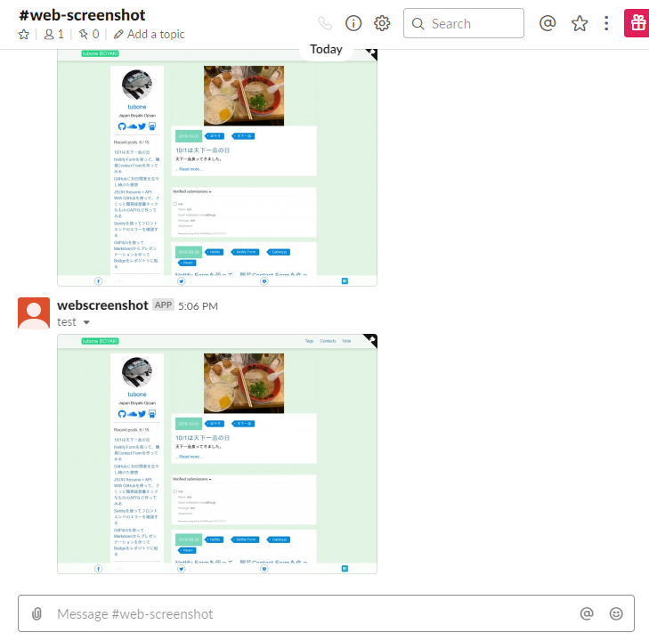

# web-screenshot-to-slack-gas


> WebScreenshot with Google Apps script and [API FLASH](https://apiflash.com/)

This app is take screenshots of Web pages with GAS(Google Apps Script) and send images to Slack channel with Slack API.

## Table of Contents

- [Background](#background)
- [Install](#install)
- [Usage](#usage)
- [API](#api)
- [Contributing](#contributing)
- [License](#license)

## Background

I should need to get a screen capture of my website and paste it into Slack channels.

Because I wanted to do it easily, instead of setting up a dedicated server, I make it as FaaS using Google Apps Script (GAS).

And also, I want to use TypeScript because of a Test and Type lint, so using with `clasp` referenced by [howdy39/gas-clasp-starter](https://github.com/howdy39/gas-clasp-starter) 

## Install

### Create GAS Project

First you create a empty GAS project from Google Drive.



When you create a GAS project, enter name and note `script ID` include the URL. (Red Underline)



Next, enter your `script ID` to `.clasp.json`

```json
{
  "scriptId": "FIXME: This value is your script ID",
  "rootDir": "dist"
}
```

### Set environment variables with Script Properties

Set your API FLASH TOKEN, Slack API TOKEN, and some variables with Script Properties





### Any optional sections

## Usage

```
```

Note: The `license` badge image link at the top of this file should be updated with the correct `:user` and `:repo`.

### Any optional sections

## API

### Any optional sections

## More optional sections

## Contributing

See [the contributing file](CONTRIBUTING.md)!

PRs accepted.

Small note: If editing the Readme, please conform to the [standard-readme](https://github.com/RichardLitt/standard-readme) specification.

### Any optional sections

## License

[MIT © Richard McRichface.](../LICENSE)


## Demos

Run the Script, send Slack.


