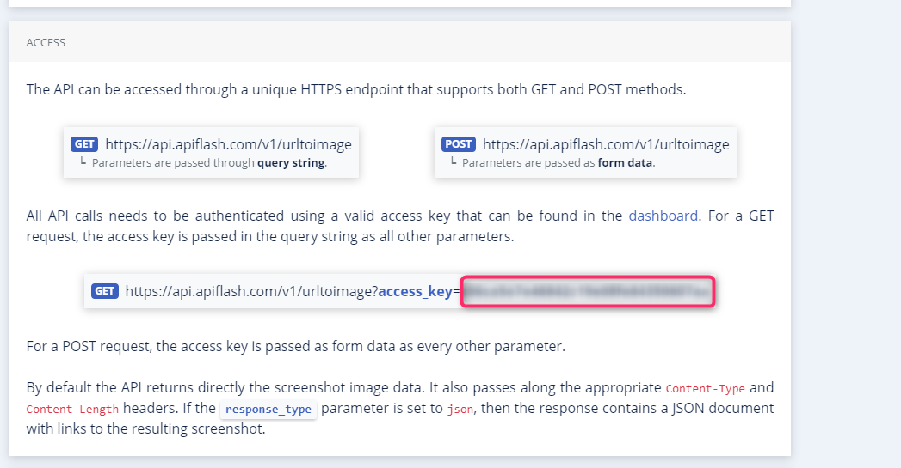
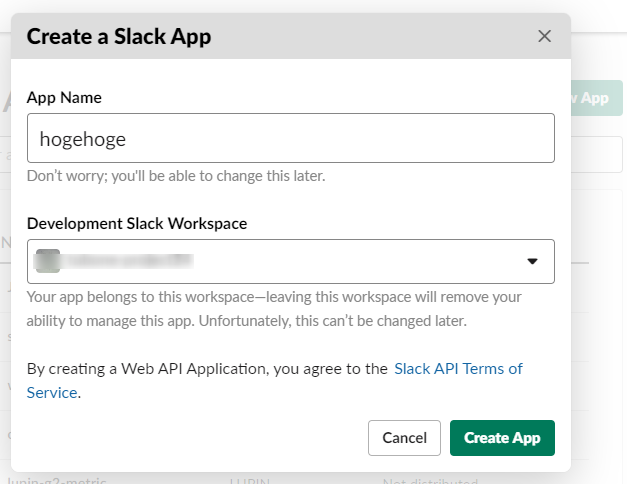
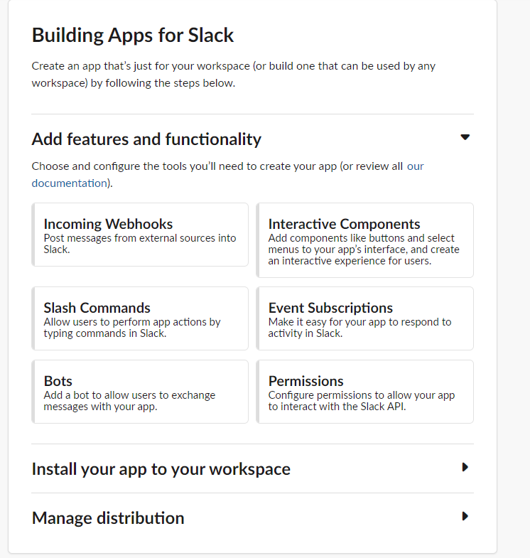
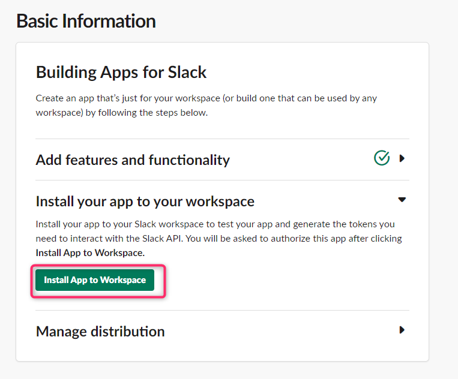
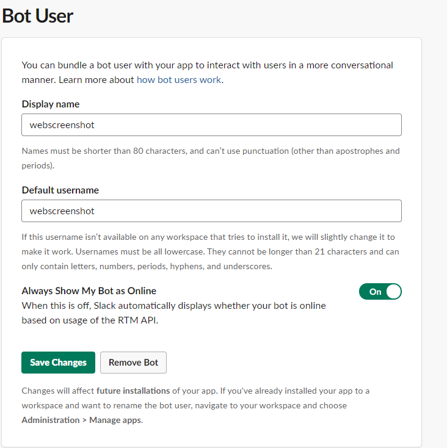
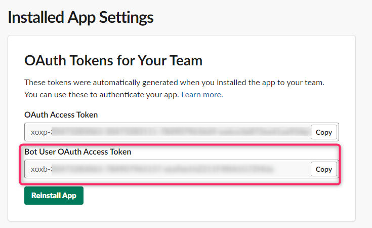

# web-screenshot-to-slack-gas


> WebScreenshot with Google Apps script and [API FLASH](https://apiflash.com/)

This app is take screenshots of Web pages with GAS(Google Apps Script) and send images to Slack channel with Slack API.

## Table of Contents

- [Background](#background)
- [Install](#install)
- [Usage](#usage)
- [API](#api)
- [Contributing](#contributing)
- [License](#license)

## Background

I should need to get a screen capture of my website and paste it into Slack channels.

Because I wanted to do it easily, instead of setting up a dedicated server, I make it as FaaS using Google Apps Script (GAS).

And also, I want to use TypeScript because of a Test and Type lint, so using with `clasp` referenced by [howdy39/gas-clasp-starter](https://github.com/howdy39/gas-clasp-starter) 

## Install

### Create API FLASH Website Screenshot API AccessKey

This tool needs to API FLASH Access key because of taking of a Web page screenshot.

Visit [https://apiflash.com](https://apiflash.com/) and signup your account.

When create your account, visit [Documentation page](https://apiflash.com/documentation), check your access key, and note this!



### Create Slack API

Visit [https://api.slack.com/apps?new_app=1](https://api.slack.com/apps?new_app=1) and Create New app



Next, you add `BOT` features because need to `Bot TOKEN`



And also, change Basic Information with API, install this app to your workspace.



Additionally, Change your Slack bot Name.



Finally, you can check your app's BOT users OAuth Access TOKEN, note this!!



### Create GAS Project

First you create a empty GAS project from Google Drive.


When you create a GAS project, enter name and note `script ID` include the URL. (Red Underline)


Next, enter your `script ID` to `.clasp.json`

```json
{
  "scriptId": "FIXME: This value is your script ID",
  "rootDir": "dist"
}
```

### Set environment variables with Script Properties

Set your API FLASH TOKEN, Slack API TOKEN, and some variables with Script Properties


### Any optional sections

## Usage

```
```

Note: The `license` badge image link at the top of this file should be updated with the correct `:user` and `:repo`.

### Any optional sections

## API

### Any optional sections

## More optional sections

## Contributing

See [the contributing file](CONTRIBUTING.md)!

PRs accepted.

Small note: If editing the Readme, please conform to the [standard-readme](https://github.com/RichardLitt/standard-readme) specification.

### Any optional sections

## License

[MIT © Richard McRichface.](../LICENSE)


## Demos

Run the Script, send Slack.


